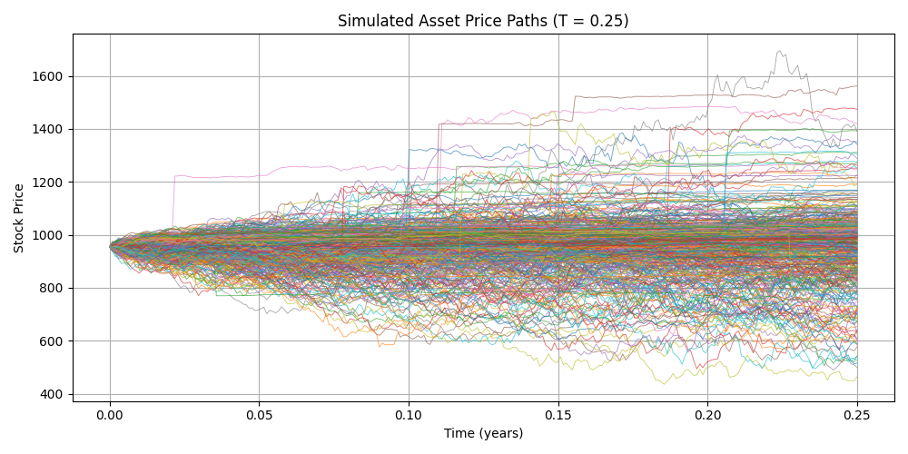

# Bonus Certificate Pricing and Hedging under the Bates Model

This project prices and hedges a Bonus Certificate structured product on **Costco (COST)** stock, using a calibrated **Bates stochastic volatility with jumps model**. The approach integrates data cleaning, implied parameter estimation, model calibration, exotic pricing, and initial hedge computation as of **2025-04-01**.

---

## Method Summary

1. **Data Cleaning**  
   Raw options data was filtered using butterfly and put-call parity checks to remove arbitrage violations.

2. **Parameter Estimation**  
   - Dividend yield estimated from past dividends: **q = 0.43%%**
   - Risk-free rate from Treasury data for T = 0.25: **r = 4.22%**

3. **Model Calibration**
   - Joint calibration across maturities (0.25, 0.5, 1.0) with stable long-run parameters
   - 3-month fine-tuning with adjusted short-term parameters
   - Final loss (3m): **202.85**

   Final 3-month smile fit:

   

4. **Exotic Pricing**  
   A grid of bonus (B) and barrier (H) levels were simulated using **Monte Carlo** with variance truncation:

   - Selected: **Bonus = 975, Barrier = 600, T = 0.25**
   - Model price: **993.83 USD**
   - Sale price with 2% markup: **1015 USD**
   - Margin: **21.17 USD per certificate**

   Payoff histogram:

   

   Payoff histogram:

   

5. **Initial Hedging Strategy**
   Using finite difference delta:

   - Delta ≈ 0.6487  
   - Hedge position ≈ **680 shares** for notional 1M USD

---

## Project Structure

```
.
├── assets/               # Output plots (smiles, residuals, payoff histograms)
├── config/               # Calibration JSON configs for Bates model
├── data/                 # Raw and cleaned options, dividend, and stock data
├── code/                 # Core model logic, pricing engine, and main notebook
├── exp/                  # Experiments for data exploration, calibration, pricing, hedging
└── requirements.txt      # Python dependencies
```

---

## Setup & Usage

### Requirements

- Python 3.10
- See `requirements.txt`

### Install dependencies

```bash
pip install -r requirements.txt
```

### Run

Open and execute the notebook:

```bash
code/structured_product_design_and_hedge.ipynb
```

---

## Notes

- Pricing is conducted under **Monte Carlo simulation** with Euler discretization and variance truncation.
- Final model is calibrated to reflect realistic short-term behavior and is **risk-adjusted via sale margin**.
- Bonus certificate issued on **Costco (COST)** starting **2025-04-01**.

---

**KU Leuven - Financial Engineering – Option Structuring Project SS2025**